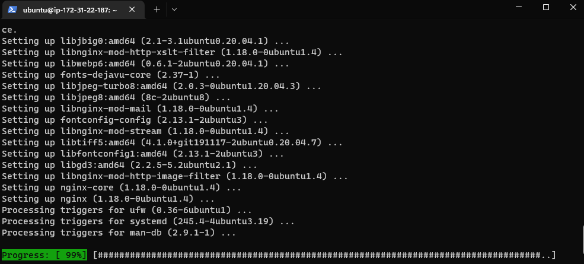
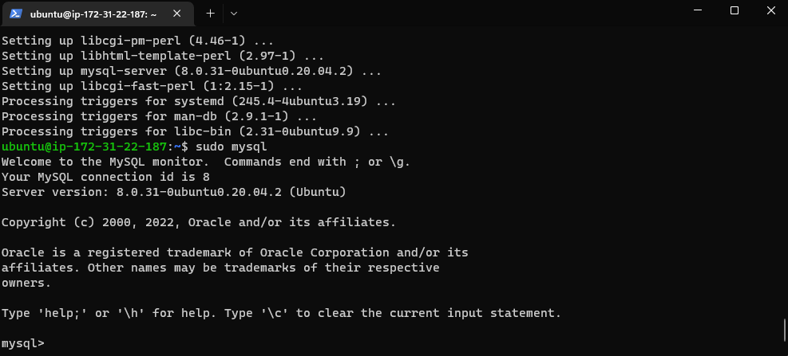
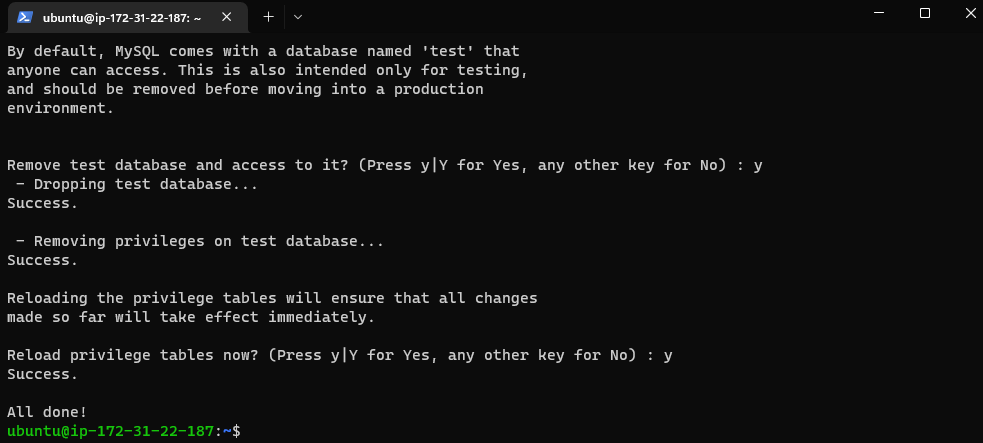
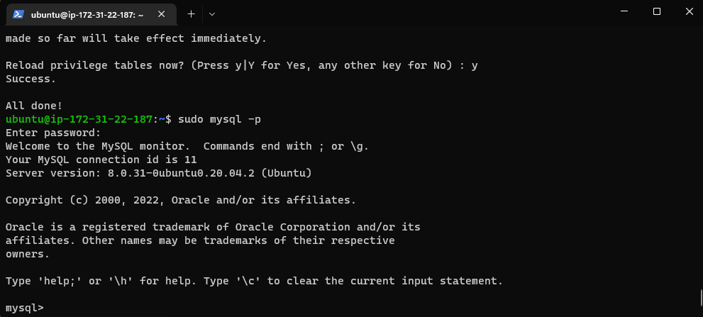
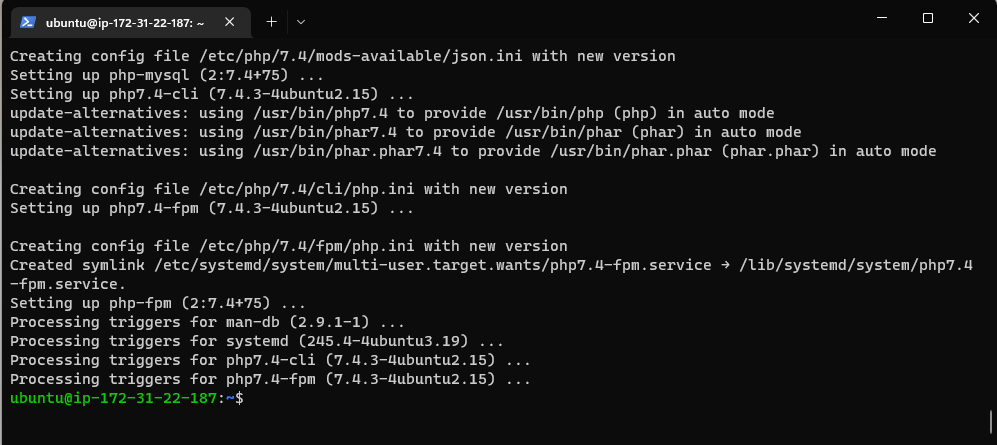
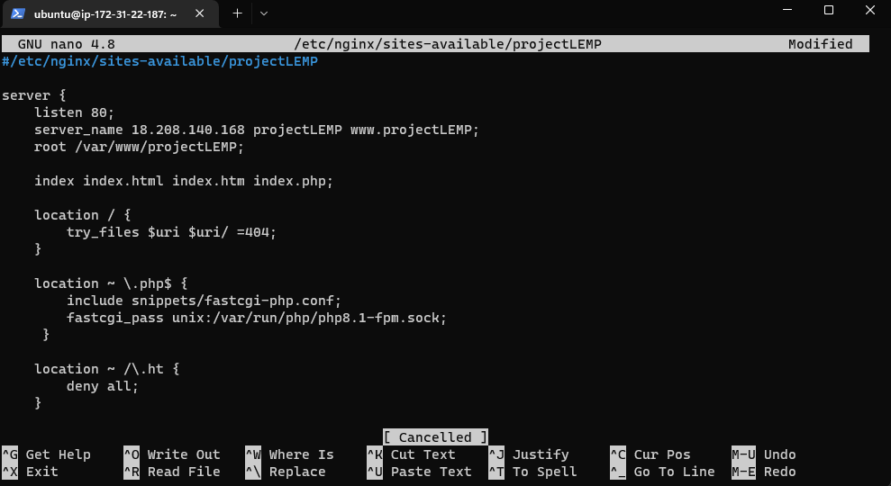
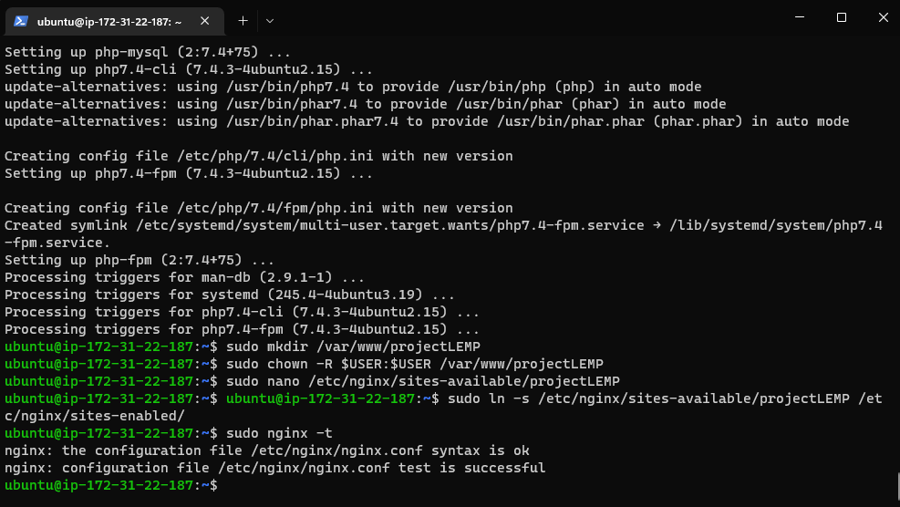
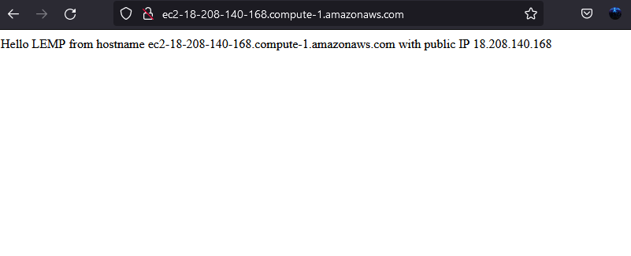
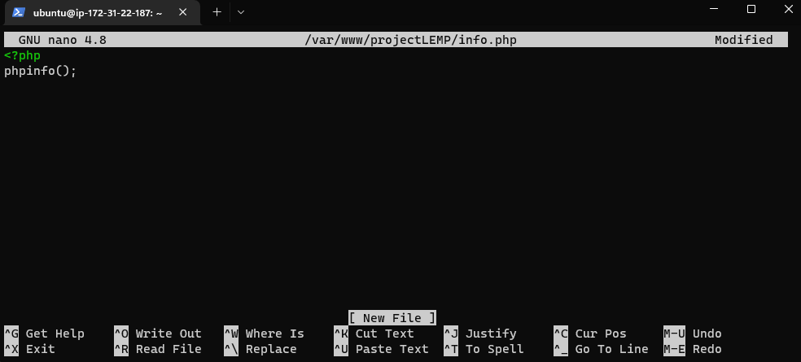

# LEMP STACK IMPLEMENTATION

## STEP 1 - INSTALLING THE NGINX WEB SERVER

Install nginx using apt package manager

`sudo apt update`

`sudo apt install nginx`

## STEP 2 - INSTALLING MYSQL

`sudo apt install mysql-server`

Set a password PassWord.1 for the root user and exit mysql

`ALTER USER 'root'@'localhost' IDENTIFIED WITH mysql_native_password BY 'PassWord.1';`

`mysql> exit`

Start the interactive security script and follow the prompt till it's all done

`sudo mysql_secure_installation`

Log in to the MySQL console to test

`sudo mysql -p`

## STEP 3 - INSTALLING PHP

Run code to install php-fpm, which tells nginx to pass php requests to this software for processing and php-mysql, which allows php to communicate with MySQL-based databases

`sudo apt install php-fpm php-mysql`

## STEP 4 - CONFIGURING NGINX TO USE PHP PROCESSOR

On Ubuntu 20.04, Nginx has one server block enabled by default and is configured to serve documents out of a directory at /var/www/html. While this works well for a single site, it can become difficult to manage if you are hosting multiple sites. Instead of modifying /var/www/html, we’ll create a directory structure within /var/www for the your_domain website, leaving /var/www/html in place as the default directory to be served if a client request does not match any other sites.

Create the root web directory for projectLEMP domain 

`sudo mkdir /var/www/projectLEMP`

Assign ownership of the directory with the $USER environment variable

`sudo chown -R $USER:$USER /var/www/projectLEMP`

Create a new config file in Nginx's sites-available directory

`sudo nano /etc/nginx/sites-available/projectLEMP`

Activate configuration by linking to the config file from nginx sites-enabled directory

`sudo ln -s /etc/nginx/sites-available/projectLEMP /etc/nginx/sites-enabled/`

check for syntax error

`sudo nginx -t`

Disable default Nginix host currently configured to listen on port 80

`sudo unlink /etc/nginx/sites-enabled/default`

Reload nginx to apply changes

`sudo systemctl reload nginx`

website is now active! create an index file in the location

`sudo echo 'Hello LEMP from hostname' $(curl -s http://169.254.169.254/latest/meta-data/public-hostname) 'with public IP' $(curl -s http://169.254.169.254/latest/meta-data/public-ipv4) > /var/www/projectLEMP/index.html`

Open website URL with IP address

`http://<public-IP-Address>:80`

## STEP 5-TESTING PHP WITH NGINX

Creating a new file info.php within document root

`sudo nano /var/www/projectLEMP/info.php`

