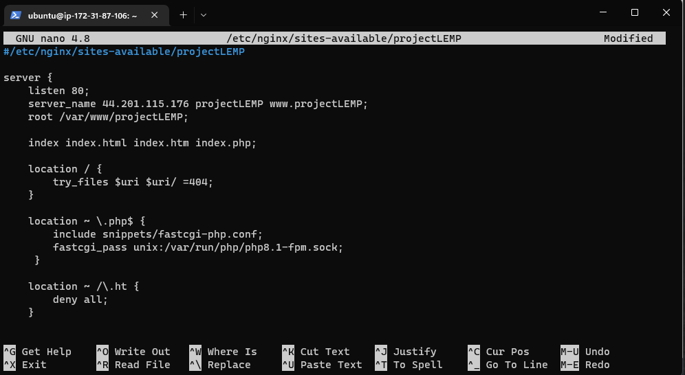

# LEMP STACK IMPLEMENTATION

## STEP 1 - INSTALLING THE NGINX WEB SERVER

Install nginx using apt package manager

`sudo apt update`

`sudo apt install nginx`


## STEP 2 - INSTALLING MYSQL

`sudo apt install mysql-server`


Set a password PassWord.1 for the root user and exit mysql

`ALTER USER 'root'@'localhost' IDENTIFIED WITH mysql_native_password BY 'PassWord.1';`

`mysql> exit`

Start the interactive security script and follow the prompt till it's all done

`sudo mysql_secure_installation`


Log in to the MySQL console to test

`sudo mysql -p`


## STEP 3 - INSTALLING PHP

Run code to install php-fpm, which tells nginx to pass php requests to this software for processing and php-mysql, which allows php to communicate with MySQL-based databases

`sudo apt install php-fpm php-mysql`


## STEP 4 - CONFIGURING NGINX TO USE PHP PROCESSOR

On Ubuntu 20.04, Nginx has one server block enabled by default and is configured to serve documents out of a directory at /var/www/html. While this works well for a single site, it can become difficult to manage if you are hosting multiple sites. Instead of modifying /var/www/html, we’ll create a directory structure within /var/www for the your_domain website, leaving /var/www/html in place as the default directory to be served if a client request does not match any other sites.

Create the root web directory for projectLEMP domain 

`sudo mkdir /var/www/projectLEMP`

Assign ownership of the directory with the $USER environment variable

`sudo chown -R $USER:$USER /var/www/projectLEMP`


Create a new config file in Nginx's sites-available directory

`sudo nano /etc/nginx/sites-available/projectLEMP`



Activate configuration by linking to the config file from nginx sites-enabled directory

`sudo ln -s /etc/nginx/sites-available/projectLEMP /etc/nginx/sites-enabled/`

check for syntax error

`sudo nginx -t`


Disable default Nginix host currently configured to listen on port 80

`sudo unlink /etc/nginx/sites-enabled/default`

Reload nginx to apply changes

`sudo systemctl reload nginx`

website is now active! create an index file in the location

`sudo echo 'Hello LEMP from hostname' $(curl -s http://169.254.169.254/latest/meta-data/public-hostname) 'with public IP' $(curl -s http://169.254.169.254/latest/meta-data/public-ipv4) > /var/www/projectLEMP/index.html`

Open website URL with IP address

`http://<public-IP-Address>:80`


## STEP 5-TESTING PHP WITH NGINX

Creating a new file info.php within document root

`sudo nano /var/www/projectLEMP/info.php`


Page can then be accessed through `http://'server_domain_or_IP'/info.php`


For security reasons, info.php is deleted

`sudo rm /var/www/projectLEMP/info.php`


# STEP 6-RETRIEVING DATA FROM MYSQL DATABASE WITH PHP (CONTINUED)

In this step you will create a test database (DB) with simple "To do list" and configure access to it, so the Nginx website would be able to query data from the DB and display it.

At the time of this writing, the native MySQL PHP library mysqlnd doesn’t support caching_sha2_authentication, the default authentication method for MySQL 8. We’ll need to create a new user with the mysql_native_password authentication method in order to be able to connect to the MySQL database from PHP.

We will create a database named example_database and a user named example_user, but you can replace these names with different values.

Connect to the mysql console using the root account `sudo mysql`


Create a new database `mysql> CREATE DATABASE `example_database`;`


Create a new user named example_user, password as PassWord.1

`mysql>  CREATE USER 'example_user'@'%' IDENTIFIED WITH mysql_native_password BY 'PassWord.1';`


Grant user permission over example_database

`mysql> GRANT ALL ON example_database.* TO 'example_user'@'%';`


exit mysql `mysql> exit`

Test if user has proper permissions by loggin in with custom user credentials

`mysql -u example_user -p`

Confirm access to the example_database

`mysql> SHOW DATABASES;`


Create a test table named todo_list

```
CREATE TABLE example_database.todo_list (
mysql>     item_id INT AUTO_INCREMENT,
mysql>     content VARCHAR(255),
mysql>     PRIMARY KEY(item_id)
mysql> );
```


Insert values `mysql> INSERT INTO example_database.todo_list (content) VALUES ("My first important item");`


Confirm data was successfully saved `mysql>  SELECT * FROM example_database.todo_list;`


Create a php file in custom web root directory
`nano /var/www/projectLEMP/todo_list.php`

Write script to connect mysql database and queries for the content of the todo_list table. Copy this content into todo_list.php:

```
<?php
$user = "example_user";
$password = "password";
$database = "example_database";
$table = "todo_list";

try {
  $db = new PDO("mysql:host=localhost;dbname=$database", $user, $password);
  echo "<h2>TODO</h2><ol>";
  foreach($db->query("SELECT content FROM $table") as $row) {
    echo "<li>" . $row['content'] . "</li>";
  }
  echo "</ol>";
} catch (PDOException $e) {
    print "Error!: " . $e->getMessage() . "<br/>";
    die();
}
```


Access the page in the web browser using `http://<Public_domain_or_IP>/todo_list.php`


## ALL DONE!

